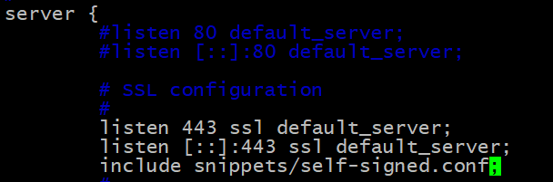
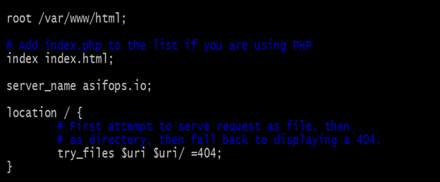
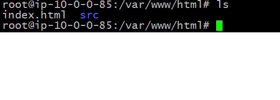
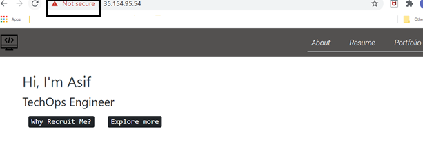

# Install NGINX with self signed SSL certificate on Ubuntu 18.04
##steps below :
1. [Update repo and install Nginx][1]
2. create openssl self sign private key and self signed certificate 
3. Create a Configuration Snippet Pointing to the SSL Key and Certificate
4. Configure Nginx sites-availabale/config file for SSL integration & website directory
5. Soft link between sites-available/config file   with sites-enable/ directory
6. Verify NGINX connection
7. Finally browse website and check whether it works or not 

## Implementation:
1. [Update repo and install Nginx] [1] 
```
sudo apt-get update && apt-get install nginx -y
sudo /etc/init.d/nginx start
[ ok ] Starting nginx (via systemctl): nginx.service.
sudo /etc/init.d/nginx status
```
2. create openssl self sign private key and self signed certificate
```
sudo openssl req -x509 -nodes -days 365 -newkey rsa:2048 -keyout /etc/ssl/private/nginx-selfsigned.key -out /etc/ssl/certs/nginx-selfsigned.crt
```
output and parameters input

```
Generating a RSA private key
........................................................+++++
..+++++
writing new private key to '/etc/ssl/private/nginx-selfsigned.key'
-----
You are about to be asked to enter information that will be incorporated
into your certificate request.
What you are about to enter is what is called a Distinguished Name or a DN.
There are quite a few fields but you can leave some blank
For some fields there will be a default value,
If you enter '.', the field will be left blank.
-----
Country Name (2 letter code) [AU]:BD
State or Province Name (full name) [Some-State]:DHK
Locality Name (eg, city) []:DHK
Organization Name (eg, company) [Internet Widgits Pty Ltd]:Self
Organizational Unit Name (eg, section) []:self
Common Name (e.g. server FQDN or YOUR name) []:asifops.io
Email Address []:
```

both of the private key and certificate files created under /etc/ssl directory 
```
ls -lrt /etc/ssl/
total 32
-rw-r--r-- 1 root root 10998 May 27 19:15 openssl.cnf
drwx------ 2 root root  4096 Nov  3 07:21 private
drwxr-xr-x 2 root root 16384 Nov  3 07:22 certs
```

3. Create a Configuration Snippet Pointing to the SSL Key and Certificate
```
sudo nano /etc/nginx/snippets/self-signed.conf
ssl_certificate /etc/ssl/certs/nginx-selfsigned.crt;
ssl_certificate_key /etc/ssl/private/nginx-selfsigned.key;
save and exit 
```

4. Configure Nginx config file for SSL integration & website directory

N.B:   /etc/nginx/sites-available directory should contain all the static files for ur website
/etc/nginx/sites-enable directory will link with /etc/nginx/sites-available. 
/etc/nginx/sites-enable directory file will read by NGINX to load the configuration

First, backup of current config file 
```
sudo cp /etc/nginx/sites-available/default /etc/nginx/sites-available/default.bak
```
second, config the default config file
```
sudo nano /etc/nginx/sites-available/default
```
comment out below lines

	#listen 80 default_server;
	#listen [::]:80 default_server;

Uncomment below lines and add line “include snippets/self-signed.conf;”  here /etc/nginx/snippets/self-signed.conf  is configuration snipset pointing to ssl private key and certificates . steps is following :

	listen 443 ssl default_server;
	 listen [::]:443 ssl default_server;
 	include snippets/self-signed.conf;



Then keep 
**index  index.html**
 besides give server name as customized name as per requirement , this name not necessary to be a FQDN . keep other parts default. 
Steps is showing following picture:   



*Finally save and exit the file*

5. Soft link between sites-available/default   with sites-enable/ directory  
first move sites-enable/ directory default config file to another file name , then
```
sudo ln -s /etc/nginx/sites-available/default  /etc/nginx/sites-enable/
```
6. Put website content at /var/www/html directory 
Here I will clone a git repository and put website files (index.html and other css files) at /var/www/html directory as sowing below :

Now site website index,html file is ready 

7. Verify NGINX connection
`sudo nginx -t`
```
nginx: the configuration file /etc/nginx/nginx.conf syntax is ok
nginx: configuration file /etc/nginx/nginx.conf test is successful
restart nginx service 
sudo /etc/init.d/nginx restart
[ ok ] Restarting nginx (via systemctl): nginx.service.
```
8. Browse website and check whether SSL work or not 
Now browse the website weith https and we can see the content of the website as showing below with SSL certification enabled. As this self sign certificate so website showing not secure option when connection , showing below picture 


